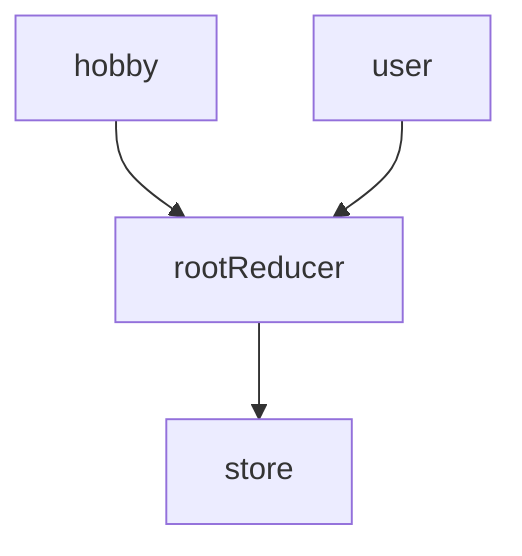
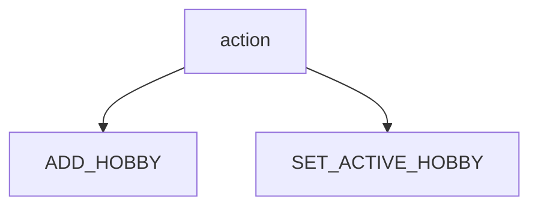
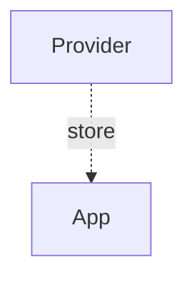
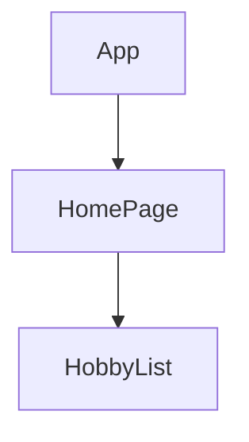
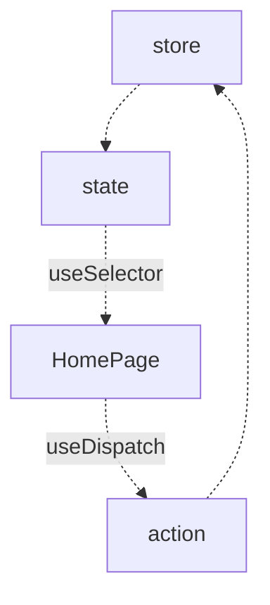

# Diagram

## Redux

### Store



```
const rootReducer = combineReducers({
  hobby: hobbyReducer,
  user: userReducer,
});
```

```
const store = createStore(rootReducer);
```

### Action



```
export const addNewHobby = (hobby) => {
  return {
    type: 'ADD_HOBBY',
    payload: hobby,
  }
}

export const setActiveHobby = (hobby) => {
  return {
    type: 'SET_ACTIVE_HOBBY',
    payload: hobby,
  }
}
```

---

## React

### State management


### Component



### UI receive state and dispatch action

